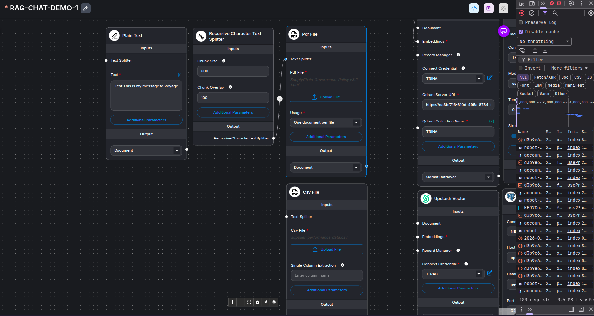
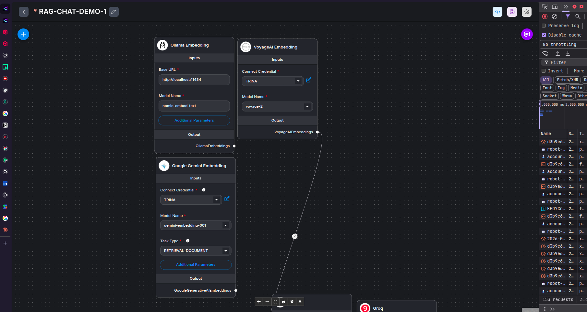
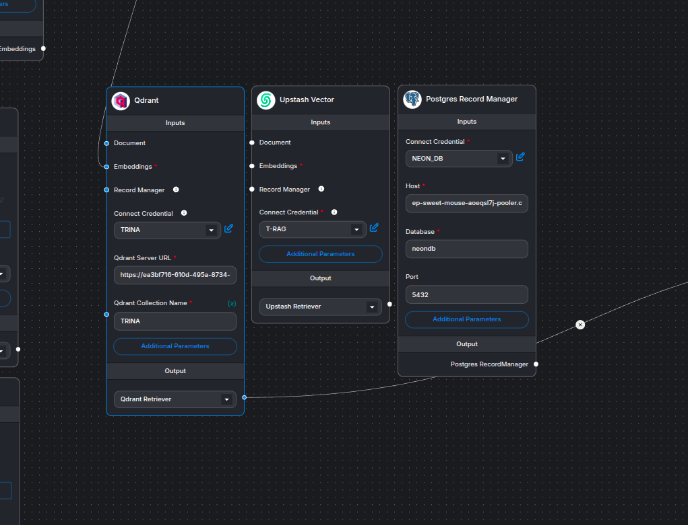
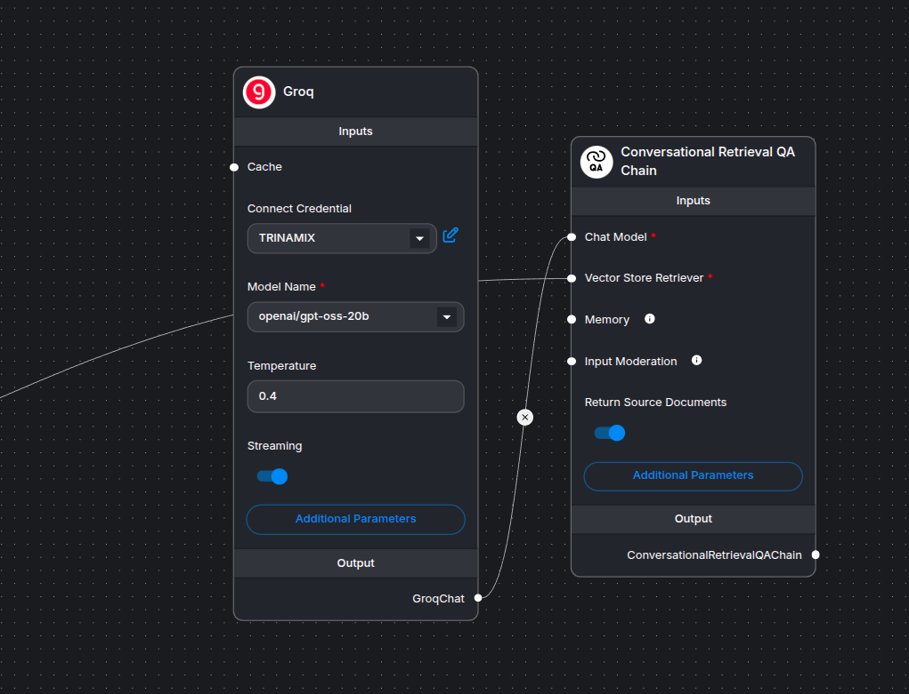
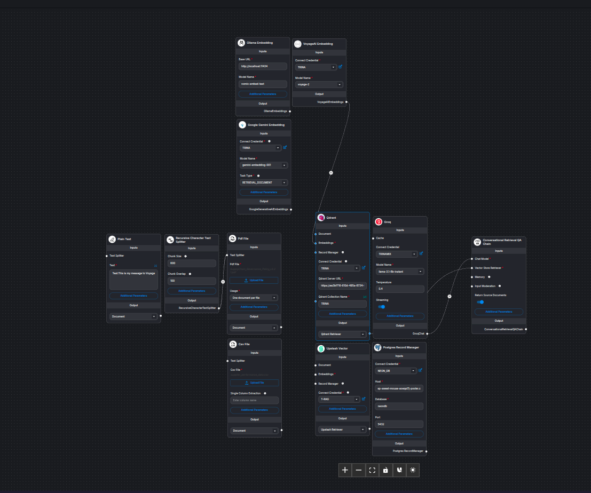
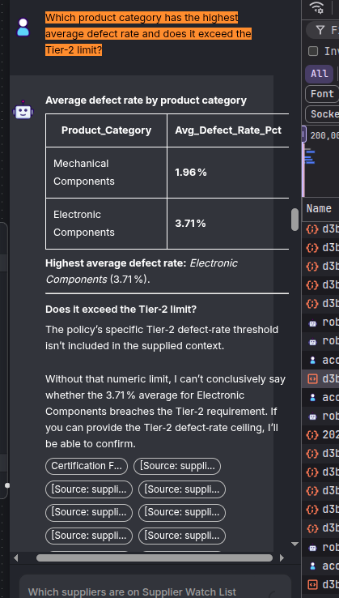
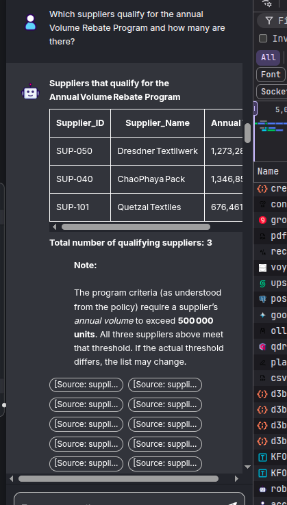
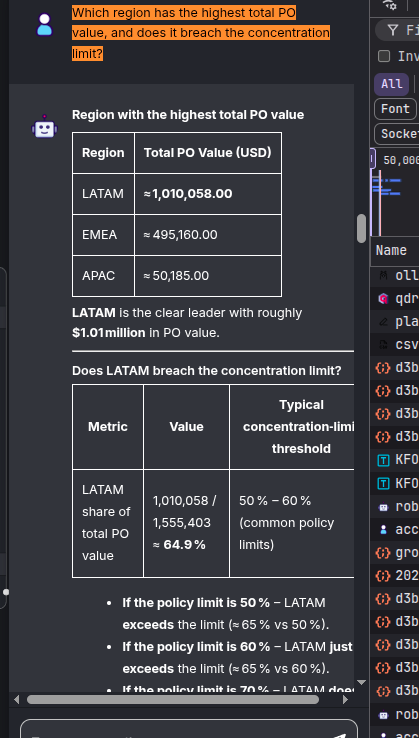
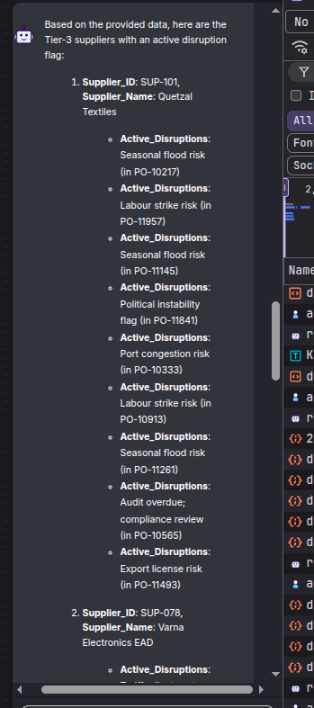
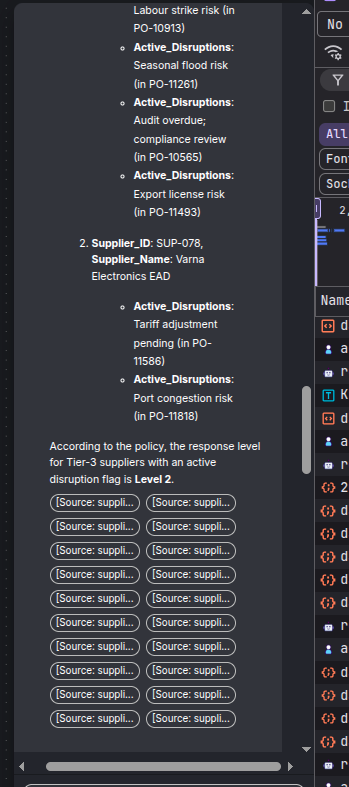

# scm-assistant-bot

My submission for the Junior AI Engineer Hiring Task (TX-JrAI-003) at Trinamix INC.

> This repository contains the code and engineering work completed within a 24-hour time constraint.

**Note:** All API keys and internal credentials visible in screenshots are dummy values and have been reconfigured.

**Deployed URL:** https://cloud.flowiseai.com/chatbot/d3b9e6ec-21bb-4e09-ab67-df6109610a02

---

## Dataset

The system operates on the following data:

| File | Contents |
|------|----------|
| `supplier_performance_data.csv` | 2,000 purchase orders · 116 suppliers · 27 columns — OTD rate, defect rate, compliance score, risk level, disruption flags, PO value, and more. |
| `SupplyChain_Governance_Policy_v3.2.pdf` | 10-section supplier governance policy — tier thresholds, SLAs, penalties, audit rules, and disruption response procedures. |

---

## Engineering Highlights

This task helped me build a unique skillset and hands-on experience. Key areas explored:

- Utilized the **Flowise Cloud** platform for the first time
- Configured and tuned a full RAG pipeline end-to-end

---

## Data Ingestion & Chunking

Understanding and optimizing the dataset ingestion required multiple rounds of experimentation.

### Approach 1 — Default Chunking (1000 / 200 overlap)

- **PDF data:** Recursive Character Text Splitter
- **CSV data:** Same splitter initially, but retrieval performance was poor

### Approach 2 — Reduced Chunking (600 / 100 overlap)

- The embedding APIs were rate-limited, and Flowise does not expose manual controls over upload processing — this made ingestion difficult to debug.
- After resolving this, loading CSVs **without a splitter** gave a significant boost to both embedding speed and context quality.

---

## Embeddings

> An **embedding** is a numerical vector representation of text that captures semantic meaning, enabling similarity-based search and retrieval.

Three embedding models were evaluated:

| Model | Provider | Notes |
|-------|----------|-------|
| `ollama` (local) | Ollama | Final solution |
| `voyage-2` | Voyage AI | Excellent quality, but heavily rate-limited |
| Gemini Embedding | Google AI Studio | Excellent quality, but model availability was inconsistent — causing unpredictable vector dimensions, which was a critical issue |

---

## Vector Store

> A **vector store** is a specialized database that stores embeddings and enables semantic similarity search for Retrieval-Augmented Generation (RAG) applications.

### Vector Database Experiments

Initially implemented with **Upstash Vector**, which worked well and was straightforward to configure.

After testing **Qdrant**, retrieval quality and consistency were noticeably better, so it was chosen as the final vector database.

#### Qdrant Configuration

| Parameter | Value |
|-----------|-------|
| Vector Dimension | 1024 |
| Similarity Metric | Cosine Similarity |
| Top-K Retrieval | 4-7 |

The Top-K value of **4-7** was selected after multiple rounds of testing. Lower values occasionally missed relevant context; higher values introduced noise. 4-7 provided the best balance between recall and response quality.

---

## Record Manager (Experiment)

> The **PostgreSQL Record Manager** tracks document metadata, indexing state, and synchronization history — preventing duplicate embeddings and enabling efficient incremental updates.

During development, the **PostgreSQL Record Manager Node** was integrated using **Neon PostgreSQL** to manage document indexing and support incremental updates.

Although it functioned correctly, it was ultimately excluded from the final architecture. Since the dataset is relatively small and static, a simpler design without a record manager reduced complexity while still meeting all requirements. The implementation remains a useful experiment demonstrating support for production-oriented document lifecycle management.

---

## Conversational Retrieval Chain

### LLM Selection & Configuration

To keep the project fully accessible and easy to reproduce, I initially experimented with several **free-tier LLM APIs** available through Flowise integrations.

The primary advantage of free models was rapid prototyping without additional infrastructure costs. However, during testing I observed a few limitations:

- Rate limiting during peak usage periods
- Occasional inconsistencies in reasoning quality
- Less reliable adherence to structured instructions
- Higher response variability on complex policy-based questions

Despite these drawbacks, free models were sufficient for iterative development and validation of the RAG pipeline.

### Final Model Configuration

For the final implementation, I used:

| Setting | Value |
|---------|-------|
| Provider | Groq |
| Model | `llama3-70b-8192` |
| Temperature | `0.4` |
| Streaming | Enabled |

A lower temperature was selected to prioritize factual consistency and reduce hallucinations when answering supplier and governance-policy queries.

### Why the Conversational Retrieval QA Chain

The chatbot was built using Flowise's **Conversational Retrieval QA Chain**.

> This chain combines document retrieval with conversational context, allowing the chatbot to answer questions using both retrieved knowledge and prior chat history.

Key reasons this chain was chosen:

- Maintains conversation context across multiple queries
- Retrieves relevant supplier and policy information from the vector database
- Produces more coherent follow-up answers
- Improves user experience over stateless question-answering flows

This approach was particularly useful when users asked follow-up questions referencing earlier messages, enabling context-aware responses grounded in retrieved documents.

---

## Full Architecture

---

## Demo — Test Case Questions

**Issues encountered:**
- When a question requires traversing a large number of chunks, the response payload becomes very large and slow to return. This was mitigated by tuning the Top-K retrieval score.

### Questions & Responses

**Q: Which product category has the highest average defect rate, and does it exceed the Tier-2 limit?**

---

**Q: Which suppliers qualify for the annual Volume Rebate Program, and how many are there?**

---

**Q: Which region has the highest total PO value, and does it breach the concentration limit?**

---

**Q: Which Tier-3 suppliers have an active disruption flag, and what response level applies per policy?**

---

**Q: Which suppliers are on Supplier Watch List (SWL) status, and what does it restrict?**

*Response not captured — the free-tier model hit its rate limit within the 24-hour constraint before this query could be tested.*

# Iprovements Suggession 
- RAG / Retrieval

    - Hybrid search (keyword + semantic) would catch exact supplier names/IDs that pure vector search misses
    - Adding metadata filtering on the CSV (tier, region, risk level) so retrieval is scoped before hitting the LLM

- Architecture

    - A reranker (e.g. Cohere Rerank) between retrieval and generation would improve answer quality more than tuning Top-K alone
    - Separate vector collections for CSV vs PDF they have very different chunk structures and mixing them hurts retrieval precision

- Reliability
    - Cache frequent queries (policy questions rarely change) to avoid rate limit hits
    - Adding a fallback LLM so the bot doesn't go silent when Groq is rate-limited
